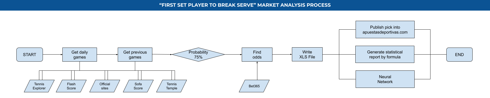

Breaks Analyzer
=================

    

Scrapper that extracts all daily tennis matches, and analyse them to predict the probability in the "First Set Player To Break Serve" market. 

* [1. Features](#block1)
* [2. Project schema](#block2)
* [3. Technologies](#block3)
* [4. License](#block4)
* [5. Author](#block5)

---

## 1. Features

- Web scrapers to get all data.
- Data analysis from February 2020.
- Multiple formulas are analized every month.
- A neural network is being trained and improved permanently.

---

## 2. Project schema

The analysis to find a profitable formula for the "First Set Player To Break Serve" market is composed of several phases.

This is the flow chart that describes the whole process.

---

## 3. Technologies

- Python 2.7
  - Click library *(Parameter control)*
  - BeautifulSoup library *(Web scrapers)*
  - PyCURL library *(Flash Score JSON access)*

- BetsAPI, from RapidAPI *(Bet365 access)*

---

## 4. License

MIT License

Copyright (c) 2021 Xavi Garcia i Sunyer

---

## 5. Author

Xavi G. Sunyer
 - <xaviergs1984@gmail.com>
 - https://www.linkedin.com/in/xavi-garcia-i-sunyer-12039520/
